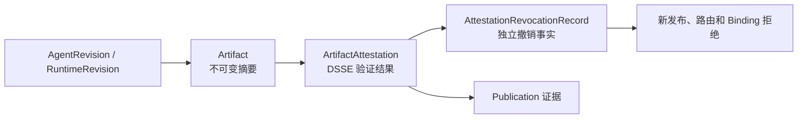

# 制品信任

## 事实模型

`Artifact` 保存租户、制品类型、修订 ID、摘要和存储引用。摘要使用 `sha256:<64 hex>`，发布与执行不得用路径、标签或可变 URL 代替摘要。

`ArtifactAttestation` 保存 DSSE Envelope（签名封装）、Builder 身份、Provenance（来源证明）、SBOM（软件物料清单）和验证结论。只有 `verificationState=verified` 且证明内容与 Artifact 精确匹配时才可进入发布证据。

撤销由独立的 `AttestationRevocationRecord` 表达。撤销不会改写历史 Attestation；新发布、新 Route Projection（路由投影）和新 ExecutionBinding（执行绑定）必须查询撤销事实并 fail-closed（无法确认时拒绝）。已创建的 Binding 保留当时冻结的 Attestation ID。

## 写入与读取边界

- 记录证明：`lib/artifacts/application/record-artifact-attestation.ts`
- 撤销证明：`lib/artifacts/application/revoke-artifact-attestation.ts`
- DSSE 验证：`lib/artifacts/domain/artifact-attestation.ts`
- 证据规则：`lib/artifacts/domain/artifact-evidence-policy.ts`
- MySQL 表与查询：`lib/artifacts/persistence/`

业务例子：RuntimeRevision 已用证明 A 发布。证明 A 后来被撤销，历史 Publication 仍可追溯到 A，但 Resolver 不再把依赖 A 的投影视为可执行，新 Binding 也会被事务内权威检查拒绝。
