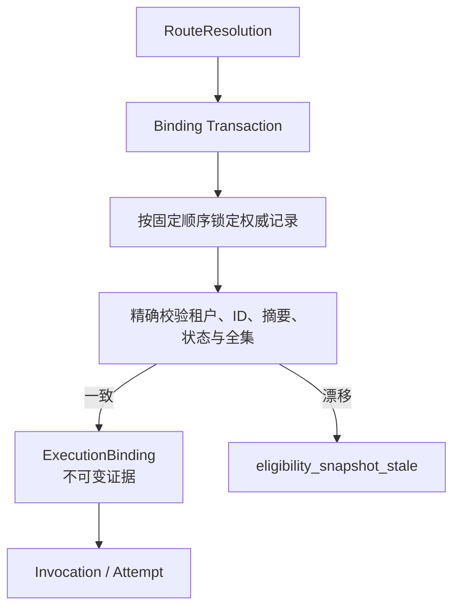

# 执行绑定

## 冻结边界

ExecutionBinding 是一次 Invocation 的不可变控制面证据。它冻结 Route/Revision/Activation、Agent/Revision、Runtime/Revision、Publication/Withdrawal、Artifact/Attestation/Revocation、Conformance、Policy、Projection 版本、配置摘要和解析输入摘要。正式证据列不可空，数组必须非空且无重复 ID。

创建 Binding 时，MySQL Store 在一个事务内按固定顺序锁定全部权威记录，重新核对冻结值与当前可执行状态，然后才写入 Binding。任一记录缺失、跨租户、已撤回、已撤销、Conformance 失效、Policy 缺失或 Projection 漂移，统一 fail-closed。

已成功写入的 Binding 不会因之后禁用 Route 或撤回 Publication 而被改写；后续变化只影响新 Binding。恢复同一 Invocation 继续使用原 Binding，Regenerate 或新 Turn 重新解析。

## 代码边界

- 领域模型：`lib/executions/domain/execution-binding.ts`
- 输入完整性：`lib/executions/application/validate-binding-eligibility.ts`
- 创建命令：`lib/executions/application/create-execution-binding.ts`
- 权威锁与持久化：`lib/executions/persistence/mysql-execution-binding-store.ts`
- 序列化：`lib/executions/application/serialize-execution-binding.ts`

业务例子：Resolver 返回后，Attestation 在 Binding 落库前被撤销。事务锁定撤销事实后拒绝创建，数据库中不会留下半有效 Binding。
