# 托管开通

## Saga 状态流

```mermaid
flowchart LR
  Request["HostedProvisioningRequest"] --> Worker["Worker 获取 Lease"]
  Worker --> Saga["HostedProvisioningSaga"]
  Saga --> Artifact["Artifact + DSSE"]
  Artifact --> Conformance["Runtime Conformance"]
  Conformance --> Publication["Revision Publication"]
  Publication --> Activation["RouteSet Activation"]
  Activation --> Projection["Outbox + Projection"]
  Projection --> Verify["verify_route"]
  Verify --> Ready["ready"]
```

Request 在创建时冻结 `agentRevisionId`，Saga 的每个步骤都使用这个精确修订。发布返回值、Checkpoint 或 Route 验证中出现其他 AgentRevision ID 时，Request 进入 `permanent_failed` 并停止后续步骤。

Worker 通过 Lease（租约）独占处理 Request。更新与释放都要求 `(requestId, leaseOwnerWorkerId)` 精确匹配且 `affectedRows === 1`；0 行或无法确认影响行数视为 lease lost（租约丢失），不得继续写状态。

步骤具有幂等键和持久 Checkpoint。重试复用既有 Artifact、Conformance、Publication 与 Activation 事实，不创建“最新修订”或隐式 Draft 作为兜底。只有 `verify_route` 确认投影与冻结证据一致，Request 才进入 `ready`。

## 代码边界

- Saga：`lib/runtime/provisioning/hosted-provisioning-saga.ts`
- Worker：`lib/runtime/provisioning/hosted-provisioning-worker.ts`
- Request Store：`lib/runtime/persistence/mysql-hosted-provisioning-request-store.ts`
- Gateway 接口：`lib/runtime/infrastructure/hosted-gateways.ts`
- MySQL Gateway：`lib/runtime/infrastructure/mysql-hosted-gateways.ts`

业务例子：用户请求开通 AgentRevision 12，但发布步骤读到 Revision 13。Saga 不会自动跟随“最新版本”，而是记录永久失败，从而避免投影与用户请求指向不同代码。
