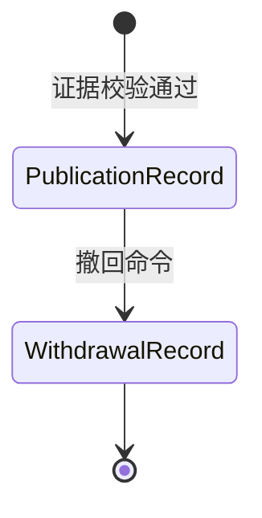

# 发布与撤回

## 事实模型

`PublicationRecord` 是 AgentRevision 或 RuntimeRevision 的一次不可变发布事实，冻结制品证据集合、审批和发布时间。`WithdrawalRecord` 是独立的撤回事实，引用原 Publication，并保存原因、操作者和时间。撤回不能通过更新 Publication 的状态来模拟。

发布入口必须在同一事务中锁定修订、Artifact、Attestation、撤销记录以及需要的 Conformance（运行时一致性）事实。任何缺失、跨租户、不匹配、未验证或已撤销状态都拒绝发布。

Runtime 发布还必须冻结通过的 `RuntimeConformanceRun`，并校验其 Artifact 摘要、配置摘要、协议版本、套件版本、报告格式和所有必需用例。Agent 发布不要求 Runtime Conformance。

## 代码边界

- 领域规则：`lib/publications/domain/`
- 发布存储：`lib/publications/persistence/publication-record.ts`
- Agent 发布：`lib/agents/application/publish-agent-revision.ts`
- Runtime 发布：`lib/runtime/provisioning/publish-runtime-revision.ts`
- 撤回读取与命令：`lib/publications/persistence/`

业务例子：某 RuntimeRevision 发布后发现供应链风险。管理员追加 WithdrawalRecord；历史 Invocation 仍能解释当时依据的 Publication，新 Route 和 Binding 则无法再选中该修订。
