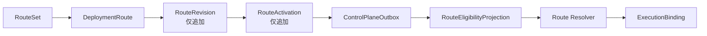

# 路由权威与解析

## 写入与读取关系

管理员按 RouteSet 原子提交一组 Route。每次有效变化创建新的 `RouteRevision`，激活时追加 `RouteActivation`；历史修订与激活记录禁止原地更新。禁用 Route 同样通过新的权威状态表达。

Projection Builder（投影构建器）从 Route、最新 Activation、Activation 指向的 Revision、RouteSet、Publication、Artifact Evidence、Conformance 和 Policy 重建可执行投影。投影缺失或关系漂移时删除旧投影，不保留推测结果。

Resolver 只读取 `eligible` 且当前有效的投影，按租户、Scope（作用域）、优先级与权重选择；其结果包含权威 ID、所有证据摘要、`projectionVersionNo` 和 `resolutionInputDigest`。Dispatcher 不重新解释路由，只把结果传入 Binding 创建。

## 代码边界

- RouteSet 命令：`lib/routes/application/activate-route-set.ts`
- 历史表：`lib/routes/persistence/route-revision-record.ts`
- 投影构建：`lib/routes/projection/build-route-eligibility.ts`
- 解析规则：`lib/routes/domain/route-resolution-policy.ts`
- 解析输入摘要：`lib/routes/domain/resolution-input-digest.ts`

业务例子：RouteSet 激活 Revision 8 后，即使 Route 主表上还有旧的便利字段，Projection 也只能沿最新 Activation 指向 Revision 8；旧解析结果在 Binding 事务中会因版本或权威 ID 漂移而失败。
