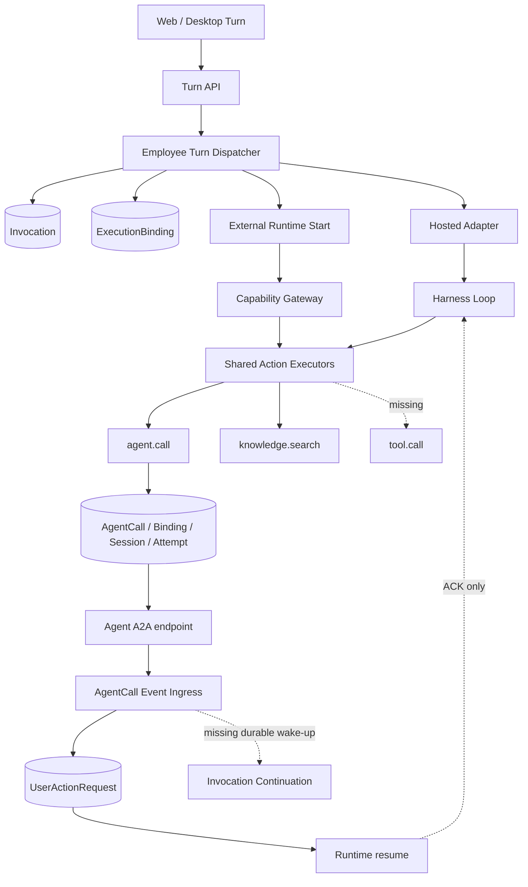
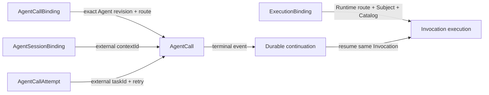

# 当前生产路径图

本图记录执行起点 `3197cfeb23070f818aacdfa7db9662986c23ecce` 的真实接线。虚线说明是待后续 Batch 关闭的缺口，不代表已实现。

## 逐路径事实

| # | 入口 | 应用服务 | Repository / 表 | 当前终点 | 当前缺口 | 验收 ID |
|---|---|---|---|---|---|---|
| 1 | `app/api/v1/threads/[thread_id]/turns/route.ts` | `acceptUserMessageTurn` → `dispatchEmployeeTurn` | Thread、Turn、ThreadItem、ThreadEvent、Invocation | Runtime dispatch | Harness 顶层关系正确，需全程回归保护 | ARC-01、ARC-03、ARC-04、ARC-08 |
| 2 | `lib/runtime/employee-turn-dispatcher.ts` | `dispatchInvocationForTurn` | Invocation、ExecutionBinding、InvocationAttempt | Runtime `start` | Subject 只在进程参数中传递；Binding 未冻结 Subject/Catalog | CAP-01、SUB-01、SUB-02 |
| 3 | `lib/runtime/in-process-hosted-runtime.ts` | `hostedAdapter.handleStart` → Harness Loop | ExecutionBinding、RuntimeEventIngress | Harness 决策循环 | 目录不足、共享工厂无 `tool.call`；resume 只 ACK | CAP-01—CAP-10、CONT-05 |
| 4 | `lib/runtime/application/build-runtime-start-request.ts` | External start request builder | ExecutionBinding、Workload binding | `app/runtime/v1/invocations/route.ts` | 请求不携带 Subject 是正确边界，但恢复路径尚未从 Binding 取回 | SUB-03、SUB-04、CONT-06 |
| 5 | `app/gateway/v1/capability-actions/route.ts` | `resolveGatewayPrincipal` | Invocation、Turn、ExecutionBinding | Shared executors | Token 已校验 invocation，但 Effective Subject 被固定成 `gateway` 身份 | SUB-03—SUB-09 |
| 6 | Hosted Adapter / Capability Gateway | `createPlatformHarnessActionExecutors` | Agent、Knowledge、后续 ToolCall | Action result | 两条路径已共用工厂；工厂仅注册 `agent.call`、`knowledge.search`、`request_user_input` | CAP-07—CAP-10 |
| 7 | `lib/agents/calls/application/agent-action-executor.ts` | Agent binding resolution → `startAgentCall` | AgentCall、AgentCallBinding、AgentSessionBinding、AgentCallAttempt | A2A transport | 幂等键未纳入冻结 revision；重复 Authority 字段仍在 AgentCall | ARC-02、DATA-01—DATA-08 |
| 8 | `start-agent-call.ts` A2A event sink | `ingestAgentCallEvents` / `apply-agent-call-events` | AgentCall、Attempt、Session、Ingress | AgentCall 状态与事件投影 | 一批事件共用旧 version；拒绝会回滚；Attempt 默认取最早记录 | DATA-09、STATE-01—STATE-04、ING-01—ING-07 |
| 9 | Agent `input-required` / 用户回答 API | `coordinateAgentInputRequired`、`resolveGenericUserAction`、`resumeAgentCallFromUserAction` | UserActionRequest、Invocation、Turn、InvocationCommand | Runtime resume command | waiting_user 协调失败被 catch+warn；回答后的恢复不具备统一持久续跑保证 | WAIT-01—WAIT-05、CONT-04 |
| 10 | `app/runtime/v1/invocations/[invocation_id]/resume/route.ts` | Runtime adapter `handleResume` | Invocation / ExecutionBinding / history | Resume ACK | Hosted resume 不执行 Harness Loop；External 也未形成同一 Invocation 的统一恢复服务 | ARC-07、CONT-04—CONT-08 |
| 11 | `scripts/worker-*.mts` | Hosted Provisioning、Control Plane Outbox Relay、Runtime Dispatch Retry | 对应请求/投递/Attempt 表 | 独立 Worker 进程 | 尚无 Invocation Continuation consumer 和固定 8 次重试策略 | CONT-01—CONT-03、CONT-09、WAIT-03 |
| 12 | `lib/persistence/schema/index.ts` | Drizzle runtime client / migrate / fresh verify | Canonical schema、`drizzle/0000_initial_schema.sql` | Runtime DB / Fresh DB manifest | 现有 123 表清单需重建；Vitest 分组存在宽泛收集与潜在重复 | SCHEMA-01—SCHEMA-05、TEST-01—TEST-05 |

## Authority 边界

后续实现不得把 Runtime Route 与 Agent Route 合并，不得让 Agent/A2A/ToolCall 直接结束父 Invocation，也不得从外部请求正文恢复 Effective Subject。
