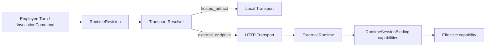

# External Runtime HTTP Transport 修复记录

- 起点 SHA：`fc1e4d9`
- 本批生产修复终点 SHA：`dfb55a4`
- 关闭问题：`P1-02`
- 残留 TODO：`0`

## 文件变化

本批修改了：

- Runtime Transport Resolver、Employee Turn dispatcher 与 Command Gateway。
- Runtime HTTP client 的响应校验和错误分类。
- RuntimeSessionBinding、effective capability 与 queued Attempt 重调度。
- canonical schema、clean initial migration、Drizzle snapshot、schema inventory 与测试登记清单。

本批新增了：

- `lib/runtime/transport/http-harness-runtime-transport.ts`
- `lib/runtime/transport/http-harness-runtime-transport.integration.test.ts`
- `lib/runtime/test-support/http-runtime-conformance-adapter.ts`

删除文件：无。

## Transport 与能力事实

- Resolver 以 `protocolType + runtimeEvidenceKind` 两个权威维度选 Transport；未知组合直接拒绝。
- `harness_runtime_protocol + hosted_artifact` 保持 local transport。
- `harness_runtime_protocol + external_endpoint` 使用绑定 endpoint/auth 的 `HttpHarnessRuntimeTransport`，覆盖 capabilities、start、cancel、resume、steer 五个 canonical route。
- Employee Turn 的 External 分支只发送 HTTP，不创建或启动 Hosted Harness Loop；外部失败不会 fallback Hosted。
- Command Gateway 对 Hosted 与 External 共用同一 resolver 和 command dispatcher。
- `startInvocation` 返回且通过 schema 校验的 capabilities 持久化到 `RuntimeSessionBinding.runtimeCapabilitiesJson`。
- 控制命令按 RuntimeRevision measured 能力与 Session 实际能力的交集判定；能力缺失或结构非法时 fail closed，不发网络。
- External start 返回能力与已发布 measured 事实不一致时返回稳定 `RUNTIME_CAPABILITY_MISMATCH`。

## HTTP 错误语义

已分别表达并验证：

- connect、DNS、timeout、TLS。
- 401/403、404、409、429、5xx。
- invalid JSON、protocol schema mismatch、capability mismatch。
- 每类错误都有稳定错误码、retryable 分类和 `dispatchPossiblyStarted` 判断。
- 503 start 会保留 queued Invocation/Attempt，并记录 `nextDispatchAt`，供后续 durable retry worker 领取。

## 安全边界

- External outbound auth 只由 `resolveOutboundRuntimeAuth()` 解析；内部 workload token 在发网前被拒绝。
- endpoint/auth 由 Transport 闭包绑定，调用方请求中的替代值不能覆盖。
- Runtime start body 不含独立 `tenantId`、`userId` 或 `execution_subject` Authority。
- External capability action 的 Subject 继续从 ExecutionBinding 恢复，外部自报字段不能覆盖。
- 测试只使用独立黑盒 HTTP server；没有启动或修改本地 `hr-agent`。

## 最终调用链

## 定向验证

- 本批 8 个定向测试文件：`193 passed`。
- `pnpm typecheck`：通过。
- `pnpm architecture:gate`：通过。
- Schema evidence：`Canonical=122, Runtime=122, Migration=122, Fresh=122`。
- 测试登记审计：通过，共登记 `419` 个测试文件。
- `git diff --check`：通过。

本批没有运行全仓 Vitest、构建、Fresh DB、Playwright 或 `pnpm topic01:acceptance`；这些按修复方案留到批次 07。
