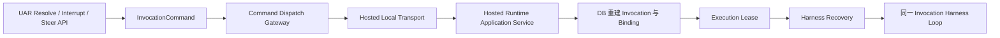

# Hosted Runtime 控制与持久恢复修复记录

- 起点 SHA：`f05c5ac`
- 本批生产修复终点 SHA：`fd4c259`
- 关闭问题：`P1-01`
- 残留 TODO：`0`

## 文件变化

本批修改了：

- Hosted Runtime 的 start、cancel、resume、steer 本地传输与正式应用服务。
- InvocationCommand dispatcher、retry gateway、UAR resolve 与 steer API。
- Harness Loop 的取消安全点、steer 上下文刷新、持久恢复与执行租约续约。
- AgentCall 子执行取消、Runtime publication conformance 测试支撑。
- canonical schema、clean initial migration、Drizzle snapshot、schema manifest 与测试登记清单。

本批新增了：

- `lib/runtime/application/hosted-runtime-application-service.ts`
- `lib/runtime/harness-loop/configured-model-ports.ts`
- `lib/runtime/harness-loop/mysql-recovery-port.db.test.ts`
- `lib/runtime/test-support/conformance-hosted-application-service.ts`

删除文件：无。

## Schema 与 Migration

- `UserActionRequest` 新增 nullable `harnessActionId`，把 generic `request_user_input` 与原 Harness action 稳定关联。
- 新增 `(invocationId, harnessActionId)` 唯一索引；非 Harness Tool UAR 可继续保持 null。
- canonical schema、`drizzle/0000_initial_schema.sql`、`drizzle/meta/0000_snapshot.json` 与 schema manifest 已同步。
- canonical schema 总表数保持 `122`，本批未新增补丁 migration。

## Authority 与控制变化

- 删除 `InProcessHostedRuntimeClient.pending` 与 `HostedAdapter.loopParamsByInvocation`；新实例只凭 `invocationId` 从数据库重建执行。
- Hosted command 不再返回 `protocol_not_remote`，统一经过 InvocationCommand、Runtime Transport Resolver、Hosted local transport 与正式应用服务。
- UAR 回答以 `UserActionRequest.resolution/responseRedactedJson` 为事实源；MySQL recovery 生成带 `harnessActionId`、`uarId`、purpose 和脱敏回答的 `user_input` observation。
- resume 重新校验 Invocation、ExecutionBinding、RuntimeRevision、Trusted Subject 与 Capability Catalog digest，并取得 execution lease 后运行同一 Invocation。
- duplicate UAR、resume command 与 steer command 不会创建双 runner 或重复 guidance；租约续约丢失会中止旧 runner，并按执行失败处理。
- live cancel 立即中止模型或下一安全点；无 live runner 时仍从数据库写入取消事件。活动 AgentCall 先走正式 cancel 协议，已确认 Effect 不回滚。
- steer 以 pending `user_guidance` 和 durable command 为事实；ack 后 Item completed，Harness 在下一决策安全点刷新 recovery context。

## 最终生产调用链

## 定向验证

- unit：`25 passed`。
- integration：`8 passed`。
- db：`264 passed`。
- `pnpm typecheck`：通过。
- `pnpm architecture:gate`：通过。
- 测试登记审计：通过，共登记 `418` 个测试文件。
- 变更文件 Biome 与 `git diff --check`：通过。

本批没有启动本地 `hr-agent`，也没有运行全仓 Vitest、构建、Fresh DB、Playwright 或 `pnpm topic01:acceptance`；这些按修复方案留到批次 07。
