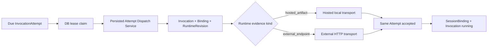

# Runtime Retry 与生产 Worker 拓扑修复记录

- 起点 SHA：`6225a0a`
- 本批生产修复终点 SHA：`4be01af`
- 关闭问题：`P1-03`、`P1-04`
- 残留 TODO：`0`

## 文件变化

本批修改了：

- Runtime 初始调度、Attempt 重试与 Command 重试的统一 transient 分类。
- Runtime dispatch retry worker 默认 Attempt lane。
- 四个 worker 脚本、package scripts 与测试登记清单。
- Architecture Gate，新增 Worker 制品与生产拓扑检查。

本批新增了：

- `lib/runtime/retry/dispatch-persisted-queued-invocation-attempt.ts`
- `lib/runtime/retry/runtime-dispatch-retry-policy.test.ts`
- `lib/workers/production-worker-role.ts`
- `lib/workers/production-worker-process.ts`
- `lib/workers/production-worker-topology.test.ts`
- `scripts/workers/worker-entrypoint.ts`
- `docker/worker/Dockerfile`
- `deploy/production/compose.yaml`

删除文件：无。

Schema 变化：无。Migration 变化：无。

## Authority 变化

- `InvocationAttempt` 继续是 Runtime retry 的唯一 durable work；重试不创建第二个 Invocation 或 Attempt。
- Worker 默认 lane 只 claim/lease，然后把同一 `attemptId` 交给 canonical persisted dispatch service。
- canonical service 从 Invocation、ExecutionBinding、RuntimeRevision、Turn input、冻结 Capability Catalog、冻结 Governance 与 Trusted Subject 重建请求。
- Hosted retry 使用 local transport，accepted 后显式启动原 Invocation；External retry 使用 HTTP transport，不 fallback Hosted。
- Runtime 错误的 `retryable` 分类成为初始 dispatch、Attempt retry、Command retry 的唯一策略输入，覆盖 connect/DNS/TLS、timeout、429 与 retryable 5xx。
- parent 已终态时只终态化遗留 Attempt，不改写 parent；耗尽和其他确定失败继续调用既有 Recovery Authority。

## 最终生产调用链

## 生产拓扑

canonical compose 明确声明五个独立角色及 replicas：

- `web-api`
- `hosted-provisioning-worker`
- `control-plane-outbox-worker`：Route projection relay 与 durable continuation consumer。
- `runtime-dispatch-retry-worker`：InvocationAttempt 与 InvocationCommand。
- `tool-execution-worker`：ToolCall、Provider execution、Effect reconcile 与 continuation。

四个 durable role 使用同一 `docker/worker/Dockerfile`，由 `WORKER_ROLE` 选择一个进程角色。startup check 校验合法 role、DB 连接、写权限和所需表；`/live` 检查 loop pulse/crash，`/ready` 检查最近成功 poll 与实时 DB 可读写。

## Crash 与并发证据

- claim 后未 dispatch：lease 到期后另一个 worker 可接管同一 Attempt。
- Runtime accepted 后平台未 commit：黑盒 External Runtime 主动断开首次响应；重发沿用 `invocation-attempt:<attemptId>`，远端只观察到一个 logical execution。
- 两个 worker 并发：`FOR UPDATE SKIP LOCKED` 保证同一 work 只有一个 active owner。
- old event 仍由 EventIngress state machine 处理；retry worker 不直接绕过 ingress 推进 parent。

## 定向验证

- 本批 9 个 retry/worker/topology 相关测试文件：`231 passed`。
- 最新修改后的聚焦复验：`19 passed`。
- `pnpm typecheck`：通过。
- `pnpm architecture:gate`：通过，包含 Durable worker production topology gate。
- `docker build --pull=false -f docker/worker/Dockerfile -t snow-harness-worker:batch05 .`：通过。
- 统一 Worker 镜像在一次性 MySQL 8.0 clean schema 上逐角色启动：四个 `/ready` 全部通过。
- `git diff --check`：通过。
- 测试登记清单：`421` 个测试文件，新增文件均唯一归组。

本批没有运行全仓 Vitest、Next.js 全量构建、Fresh DB 完整验收、Playwright 或 `pnpm topic01:acceptance`；这些按修复方案留到批次 07。
